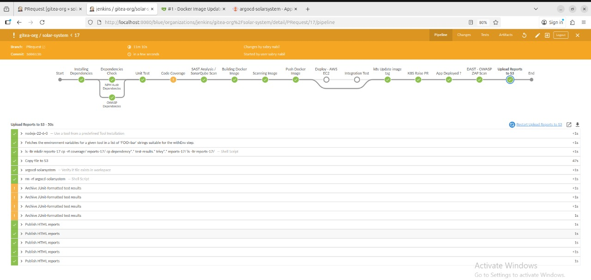

# 🚀 DevOps Project: CI/CD Pipeline with Jenkins, ArgoCD & AWS

This project demonstrates a complete **DevOps pipeline** that automates building, testing, containerizing, and deploying a Node.js application using **Jenkins**, **Gitea**, **ArgoCD**, **Docker**, and **AWS S3**.

---

## 🧠 Project Overview
The goal of this project is to automate the entire software delivery lifecycle — from **code commit to deployment** — using modern DevOps practices.

---

## 🧩 Tools & Technologies
- **Version Control:** Gitea  
- **CI/CD Orchestration:** Jenkins  
- **Containerization:** Docker  
- **GitOps Deployment:** ArgoCD on Kubernetes  
- **Cloud Storage:** AWS S3  
- **Monitoring & Reports:** Jenkins HTML Publisher  

---

## ⚙️ Pipeline Workflow

1. **Code Commit:** Developer pushes code to Gitea repository.  
2. **Continuous Integration (CI):**  
   - Jenkins automatically triggers on commit.  
   - Installs dependencies and runs unit tests.  
   - Builds Docker image and pushes it to Docker Hub.  
3. **Continuous Delivery (CD):**  
   - Jenkins updates deployment manifest in Gitea.  
   - Creates a Pull Request for review.  
4. **GitOps Deployment:**  
   - Once PR is approved, **ArgoCD** syncs the latest image to the Kubernetes cluster.  
5. **Reporting:**  
   - Jenkins publishes reports and stores them in **AWS S3** for visibility.  

---

## 🧱 Architecture Diagram

*(You can upload the diagram I made for you here under `docs/devops-architecture.png`)*

---

## 🧩 Jenkins Pipeline Stages
| Stage | Description |
|--------|-------------|
| Installing Dependencies | Installs required npm packages |
| Unit Test | Runs automated tests |
| Code Coverage | Measures test coverage |
| Build Docker Image | Creates Docker image from source |
| Push Docker Image | Pushes to Docker Hub |
| Update Kubernetes Manifests | Updates deployment YAML in Gitea |
| ArgoCD Sync | Deploys the new version to Kubernetes |
| Reports Upload | Sends generated reports to AWS S3 |

---

## ☁️ AWS Integration
- **EC2:** Used for hosting Jenkins and ArgoCD.  
- **S3:** Stores generated scan and build reports.  

---

## 📦 Prerequisites
- Jenkins with required plugins:
  - Pipeline
  - Docker
  - Git
  - HTML Publisher
  - AWS Credentials
- Gitea for version control
- ArgoCD configured with Kubernetes cluster
- Docker Hub account

---

## 🧑‍💻 Author
**Sabry Nabil**  
DevOps & Cloud Enthusiast  
🌐 [LinkedIn](https://linkedin.com/in/sabrynabil) | [GitHub](https://github.com/sabrynabil)

---

## 🪪 License
This project is open-source and available under the [MIT License](LICENSE).
